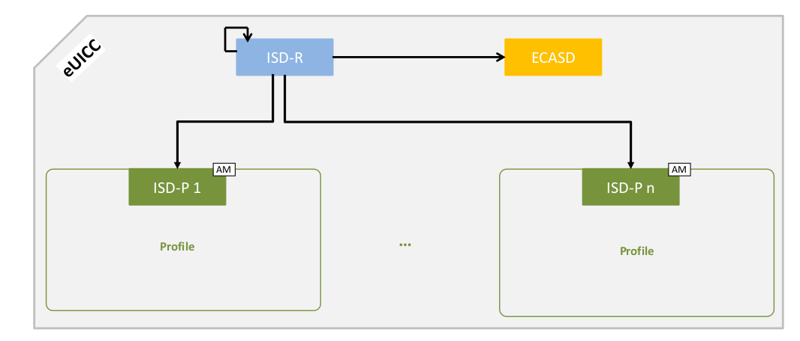

## M2M Solution

* Remote SIM Provisioning for M2M utilises a server driven (push model) to provision and remotely manage operator Profiles
* elements:
 * SM-DP (Subscription Manager - Data Preparation),
 * SM-SR (Subscription Manager - Secure Routing) 
 * eUICC

### SM-DP
* responsible for preparing, storing and protecting operator Profiles
* downloads and install Profiles onto the eUICC
* 

### SM-SR
* managing the status of Profiles on the eUICC (enable, disable,delete)
* secures the communications link between the eUICC and SM-DP

### eUICC 
* secure element that contains one or more subscription Profiles.

### SM-DS
* Subscription Manager - Discovery Server
* provides a means for an SM-DP+ to reach the eUICC without having to know which network the device is connected to.
* SM-DS allowing SM-DP to post alerts to a secure noticeboard and for devices to extract those alerts
* is used to notify the LPA when Profile data is available for download to the eUICC
* The device LPA polls the SM-DS for notifications when required (supporting the “pull” model)
* Polling frequency is determined by the eUICC state and by end user actions

### LPA
* Local Profile Assistant
* a set of functions in the device responsible for providing the capability to download encrypted Profiles to the eUICC
* LPA may also be in built into the eUICC

## Domains

* ISD-R is the representative of the off-card entity SM-SR
* ECASD is the representative of the off-card entity CI
* ISD-P is the representative of an off-card entity SM-DP. 
* An eUICC can contain more than one ISD-P

### ISD-R
* There SHALL be only one ISD-R on an eUICC.
* ISD-R SHALL be installed and first personalized by the EUM during eUICC manufacturin
* After eUICC manufacturing, the ISD-R SHALL be in life-cycle state PERSONALIZED
* The LOCKED state SHALL NOT be supported by the ISD-R

### ECASD
* There SHALL be only one ECASD on an eUICC.
* The ECASD SHALL be Associated with the ISD-R
* The ECASD SHALL be personalized by the EUM during eUICC manufacturing with:
  * PK.CI.ECDSA
  * SK.ECASD.ECKA
  * CERT.ECASD.ECKA for eUICC Authentication and key establishment
  * EID

### ISD-P
* hosts a unique Profile.
* Only one ISD-P SHALL be enabled on an eUICC at any point in time.
* An ISD-P SHALL be installed by the ISD-R and then personalized by its related SM-DP
* 
