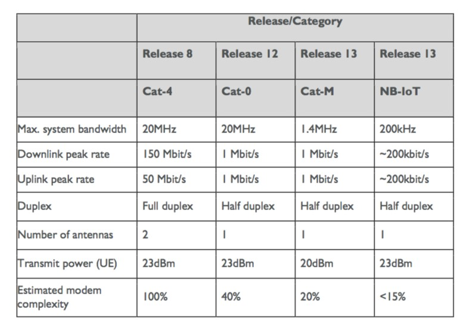

# catX

# 2g:

## EC-GSM
* Extended Coverage -  the IoT-optimized GSM network
* can be deployed in existing GSM networks
* 

#3g:

## cat1
* already standardized
* Cat-1 is replacing 3G

#4g:

## cat0
* Cat-0 optimizes for cost
* Cat-0 is the protocol that set the groundwork for Cat-M replacing 2G as the cheaper option
* 

## Cat-M1
* capping the maximum system bandwidth at 1.4 MHz (as opposed to Cat-0’s 20 MHz)
* compatible with the existing LTE networks
* meshing Cat-M into LTE networks requires a software patch
* 

## Cat-M2: NB-IoT
* uses DSSS modulation instead of LTE radios
* NB-IoT doesn’t operate in the LTE band
* eliminates the need for a gateway
* sensor data is sent directly to the primary server
* 

# 5G:

TBD

