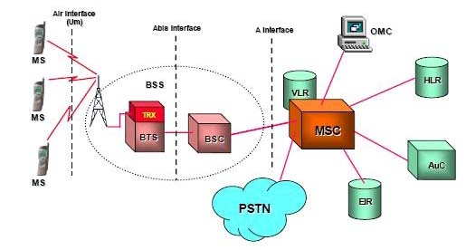

# 2G Architecture

## layers
* transport plane (voice)
* signaling plane (ss7)

## parts:
* ms - mobile equipment
* BTS - base transceiver station
* BSC - base station controller
* bss - bts + bsc = base system subsystem
* msc - mobile service switching controller
  - hlr : home location register  
  - vlr : visitor location register
  - eir : equipment identity register
  - gmsc : gateway MSC
  - auc : authentication center
  - smsc : short sms center
* pstn :

## BSS  
* communicate over standard ABIS interface
* allow communication over different vendors

### BTS
*  encode / encrupt / multiplexes / modulates / feeds the RF signal
* communicate with mobule station and BSC
* consist of TRx units

### BSC
* manage radio resources of bts
* assign freq and time slots for all MS
* call set up
* handover
* radio power controller
* communicate with msc and BTS

## MSC
* ran to core interface
* perform switching and signaling
* call setup
* call routing
* billing
* communication between GSM and other networks
* mobility management
* gateway functionality

### HLR
* db of mobile subscribers
* identification
  - imsi / msisdn
  - ms category
* service
  - roaming restrictions
  - services (call forward)
* security
  - authentication and encruption keys
* location
  - VLR
  - MSC
  - roaming data - MSRN (mobile subscriber roaming net)

### VLR
* temporary db
* asssign tmsi
* less quires to hlr

### AUC
* secure data of subscriber (identity and keys)
* algorithms for generating authentication

### EIR
* validate mobile equipment hardware identity
* manage ms status list
  - black list
  - gray list
  - white list
