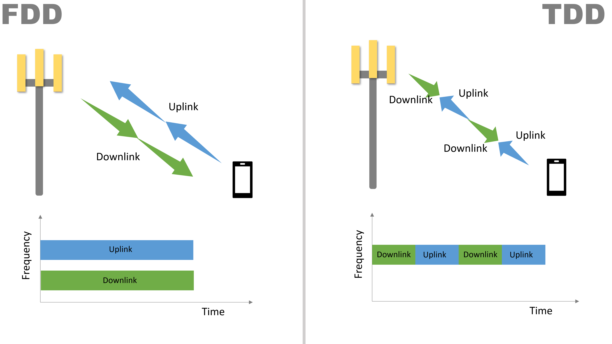

# duplex mode

* simultaneous bi directional link transmissions:
* FDD - frequency division duplexing
* TDD - Time division duplexing

## FDD
* seperate UP/DL in frequency domain
* no support for asymmetric traffic
* Lte/ umts / gsm / is-95 / amps 

## TDD
* seperate UP/DL in time domain
* UL+DL on single band
* support for asymmetric traffic
* DECT/LTE/UMTS

