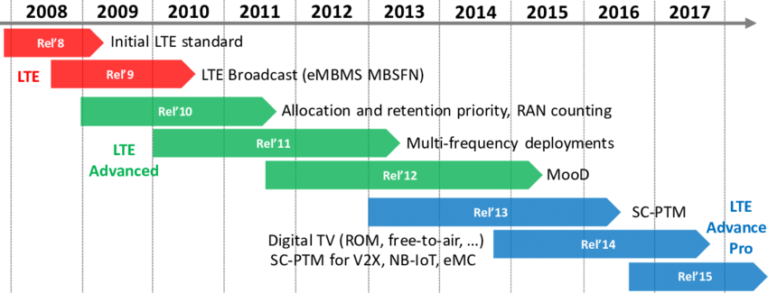
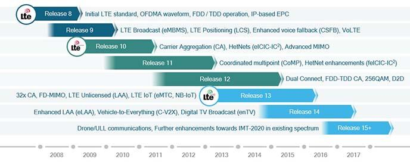

# rel2gen

```
LTE
	Rel 8	initial LTE
	Rel 9	Lte Brodcast

LTE-ADVANCED
	Rel 10	
	Rel 11
	Rel 12

LTE-ADVANCED-PRO
	Rel 13
	Rel 14

5G
	Rel 14	5G study
	Rel 15	5G phase 1
	Rel 16	5G phase 2

```

  

  

