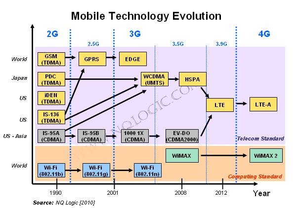
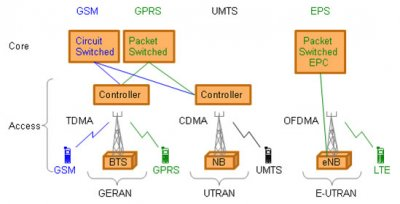

# migration 

* 1G - analog voice
* 2G - Digital Voice ; GSM / CDMA
* 2.5G - Packet data ; GPRS / CDMA-1xRTT
* 2.75 - inetrmidiata multimedia ; 
* 3G - multimedia ; UMTS-HSPA / CDMA2000-EVDO
* 4G - ; LTE / NR
* 5G - ALl ip

