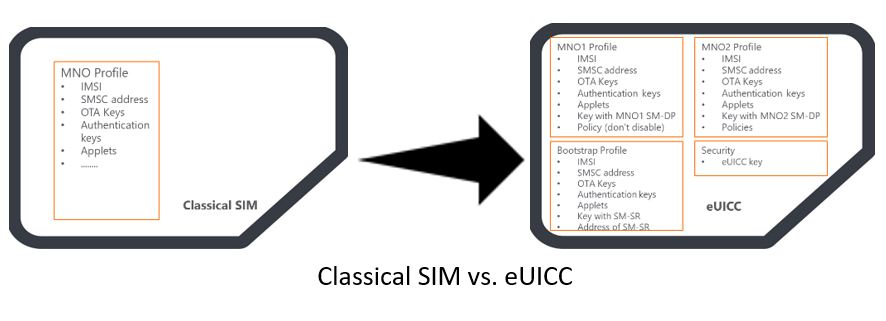

# eUICC

## links

* https://www.gsma.com/newsroom/resources/?kw=sgp
* https://www.youtube.com/watch?v=wIXXkRervh8
* https://www.avnet.com/wps/portal/silica/products/new-products/npi/avnet-euicc/

## about

*  eSIM specifications from the GSMA describe two main components: the eUICC (embedded UICC) which is considered as the next evolution of the SIM cards and the Subscription Management platform (SM). 
* eUICC can store multiple operator profiles instead of only one.
* eSIM architecture enables over-the-air replacement of the mobile network operator (MNO) profile (virtual SIM) 
* eUICCs can be manufactured with just a bootstrap profile that enables the customer’s device to connect to subscription management (SM) platform

## SM
* subscription Management platform
* consists of two components: Subscription Management Secure Routing (SM-SR) and the subscription Management Data Preparation (SM-DP).
* the vendor of the eUICC registers the card (e.g., certificate, identity) at the SM-SR
* The SM-SR is the only entity that can contact the eUICC for the purpose of subscription management directly and maintains a secure connection to the eUICC
* SM-SR  enforce the Profile policies (allow disablement of a profile) and route the commands from the MNO and SM-DP to the eUICC
* SM-DP has a secure connection to the SM-SR and is responsible for preparing and saving the MNO profiles in a format compatible with the eUICC

